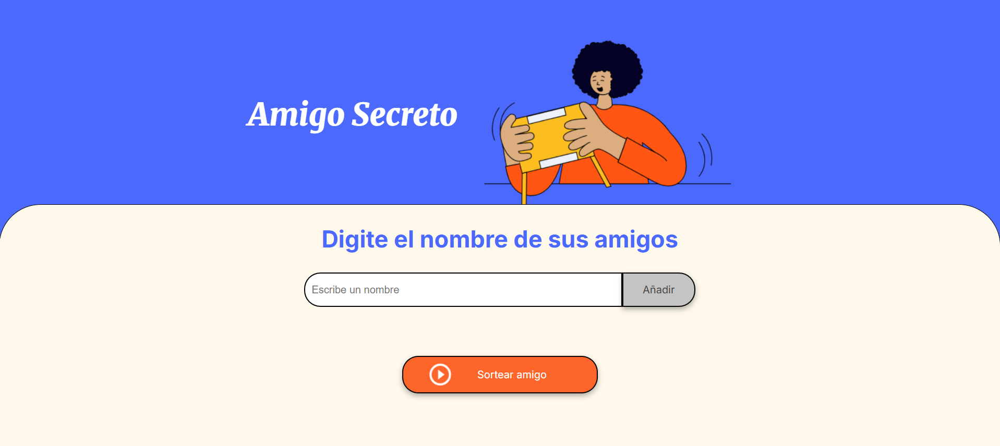
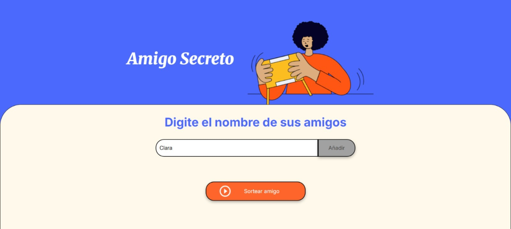
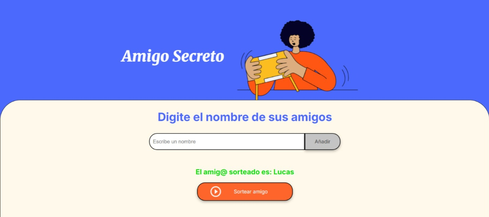
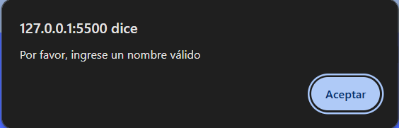
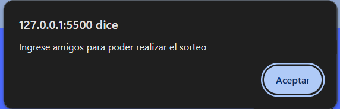

<h1 align="center"> Challenge Amigo Secreto </h1>

<h2>Descripción del proyecto </h2>

Este proyecto consiste en una aplicación interactiva desarrollada con JavaScript, HTML y CSS, que permite a los usuarios agregar nombres de amigos a una lista y, posteriormente, realizar un sorteo aleatorio para seleccionar a uno de ellos.

<h2>Características de la aplicación </h2>
<h3>🛠 Funcionalidades: </h3>
<ul>
    <li>Función 1 (agregarAmigo()): Añade amigos a la lista ingresando sus nombres en un campo de texto </li>
    <li>Funcíon 2 (actualizarLista()): Muestra la lista de nombres actualizada en pantalla </li>
    <li>Función 3 (sortearAmigo()): Realiza un sorteo aleatorio entre todos los amigos ingresados </li>
    <li>Función 4 (LimpiarAmigos()): Limpia la lista de amigos cuando sea necesario </li>
    <li>Función 5 (LimpiarCampo()): Muestra el resultado del sorteo en la interfaz </li>
</ul>

<h2>Cómo se utiliza la aplicación? </h2>
<ul>
    <li>Al iniciar la aplicación se visualiza la siguiente interfaz </li>
    
    <li>Luego se ingresan los nombres de los amigos que serán sorteados</li>
    
    <li>Todos los amigos añadidos se visualizarán en una lista por debajo </li>
     
    <li>Al presionar el botón "Sorter Amigo", se seleccionará el nombre de un amigo aleatoriamente </li>
     
</ul>

<h3> 🔔 Importante 🔔</h3>

 Si el usuario no ingresa nombres, o la lista está vacía se lanzará alguno de los siguientes errores

<li></li>

